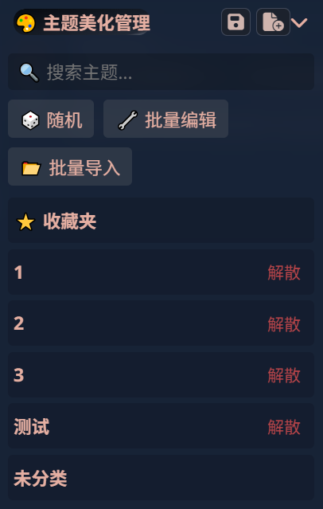
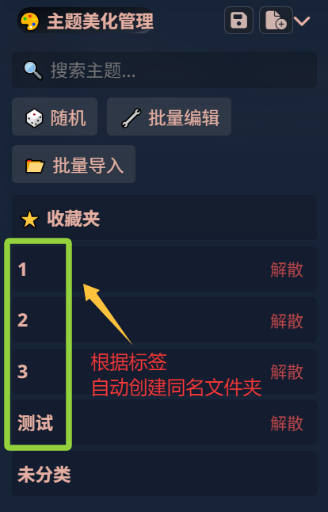
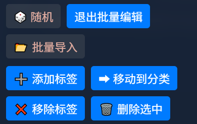
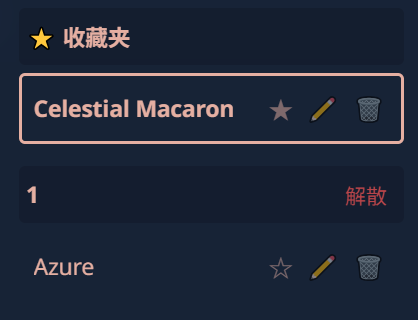

# 酒馆美化管理助手
- 主要是为了我自己管理美化方便，bug一堆无力肘击，问我也不一定能解决，可以自己下载文件去问AI。
- 每次更新后需要手动刷新！第一次导入不用。
- 就在酒馆原生的换美化的位置，把拓展的勾选勾掉就会变回原生的样子，更方便。

## 功能简介：
- 文件夹
  - 自分类：凡是符合“[标签]美化名称”“美化名称[标签]”格式的美化，都可以自动创建和标签名一样的文件夹，自动收纳。
  - 标签：标签可以添加多个，会被同时收纳进不同文件夹。
  - 点击文件夹右侧的“解散”可一键去除该文件夹内美化的标签（只去除和该文件夹同名的标签），即解散文件夹。

- 批量导入
  - 点击“批量导入”按钮，可多选json格式的美化文件同时导入，导入后页面自动刷新。
  - 精力有限没有做更多细节，不要导入同名文件，虽然可以导入成功，但看着累赘（而且删除的时候好像会把同名文件一起删除？）
  - 有一个一直没肘赢的bug：用插件删除某美化后，再用原生的导入按钮导入刚刚删掉的美化，会报错“同名文件已存在”。我是笨蛋我肘失败了，如果想重新导入的话，①刷新后再导，用插件或原生的都行；②不用刷新，直接用插件导入。
- 批量编辑
  - 点击“批量编辑”按钮进入编辑模式，此模式下点击美化名字不会更换美化，可以多选，然后进行下一步操作。
  - 一共有四个批量编辑功能，点击后会弹出提示框，根据提示框来操作即可：

  - 编辑后记得退出编辑模式！
- 单独功能
  - 点击美化名右边的星星符号即可收藏，被收藏的美化会自动移入最上方的收藏夹，再次点击星星可取消收藏。
  - 点击右侧铅笔图标可重命名（别和别的文件名字一样，可能会有不报错的bug，我没写报错功能）。
  - 点击右侧垃圾桶图标可删除该美化文件。

- 搜索
  - 美化太多了找不到想要的？点击上方搜索栏，支持模糊搜索，只要你能记得你想要找的美化名任何一个字就行。
- 随机
  - 掷骰子吧，随机换装一个已导入的美化~
- 折叠收纳
  - 文件夹和插件本身都可以折叠起来，优化视觉体验。
- 半兼容原生功能
  - 保留了原生的导入、导出、保存和另存功能，基本是没有冲突的，如果报错就手动刷新酒馆再试，刷新可以解决绝大部分问题。
- 自适应主题色
  - 会自己换衣服，很省心的插件宝宝一枚（什）。
  - 当前正在应用的美化会被圈出来，多选时被选中的美化也会有颜色区分。
